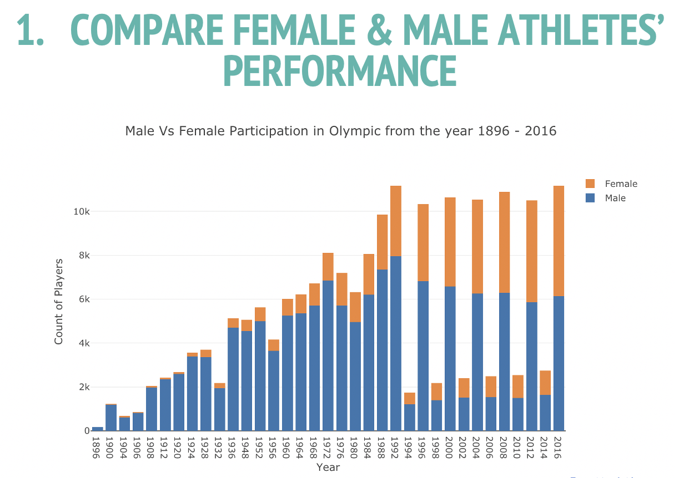
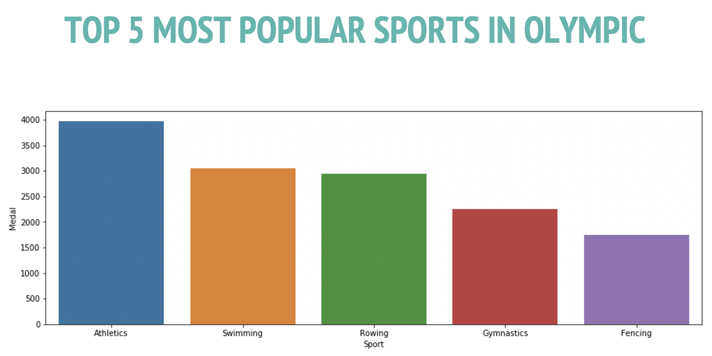

## Portfolio

---

### Data Management Project

[Analyze Olympic History Dataset on Kaggle | SQL, Dimensional tables with PostgreSQL and AWS. ](/pdf/sample_presentation.pdf)

---

### R Programming Product

[Created interactive R Shiny app to allow decision makers comparing the difference among distributions in term of visualizations, observations and summary outputs](/sample_page)

---

### Python Programming Product

[Built a reactive dashboard in Python using Dash framework](https://laurale.shinyapps.io/G28765955/)

---
