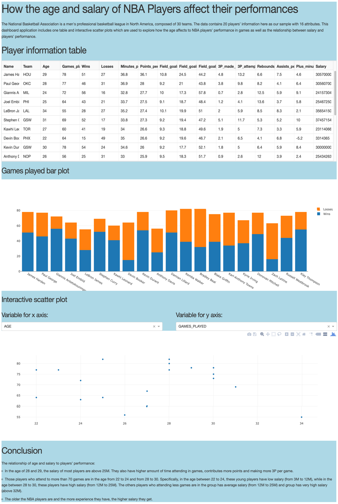

## How the age and salary of NBA players affect their performances.

**Project description:** Built a reactive dashboard in Python using Dash framework to analyze NBA basketball players data and show the insights about relationship between age, salary and experience of these players.

### Analyze dataset:

### Conclusion:

The relationship of age and salary to players’ performance:
- In the age of 28 and 29, the salary of most players are above 25M. They also have higher amount of time attending in games, contributes more points and making more 3P per game.
- Those players who attend to more than 70 games are in the age from 22 to 24 and from 28 to 30. Specifically, in the age between 22 to 24, these young players have low salary (from 3M to 12M), while in the age between 28 to 30, these players have high salary (from 12M to 25M). The others players who attending less games are in the group has average salary (from 12M to 25M) and group has very high salary (above 32M).
- The older the NBA players are and the more experience they have, the higher salary they get.
